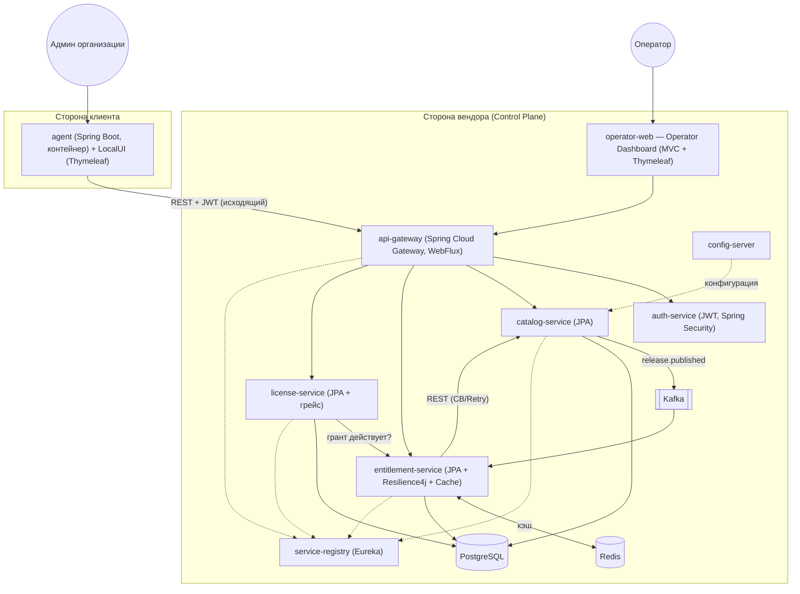
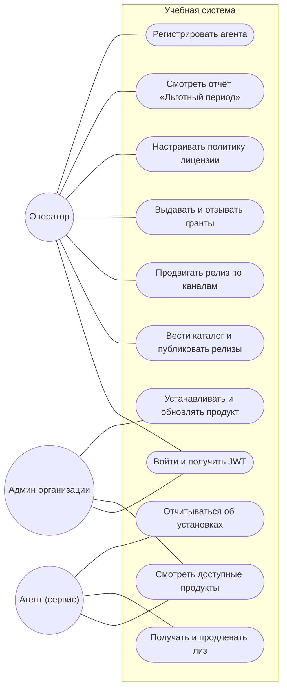
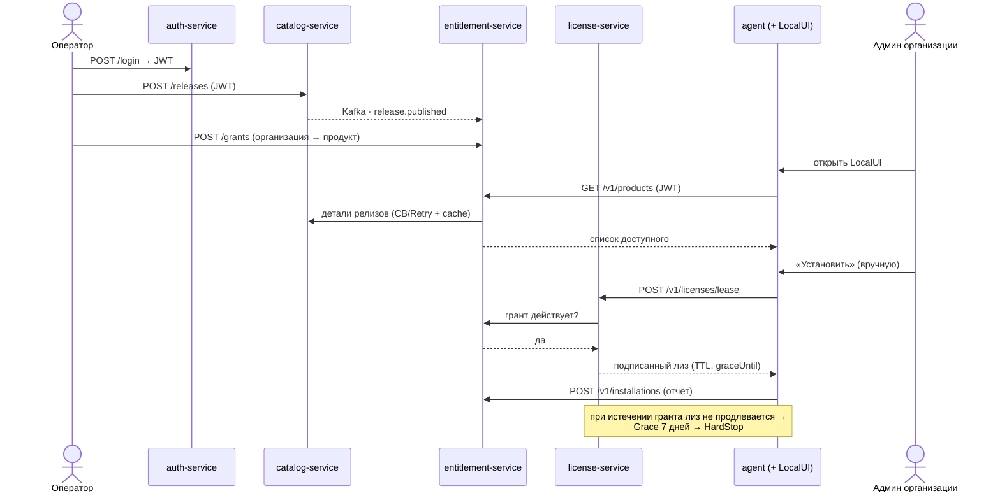
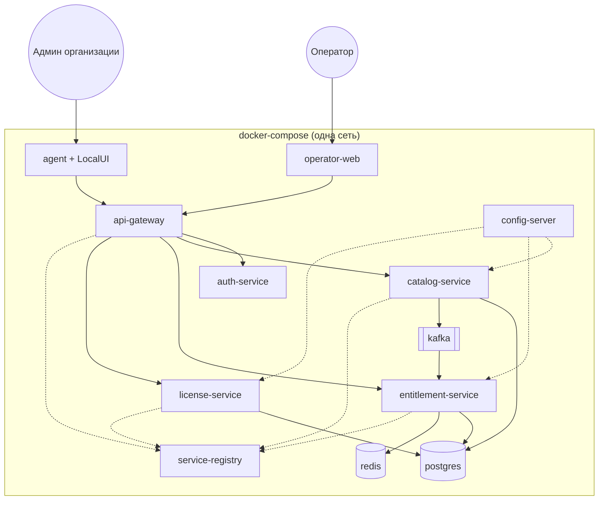

# InversionWharf — План учебного демо-проекта

> Учебная версия системы из [`TECHNICAL_SPEC.md`](./TECHNICAL_SPEC.md), урезанная под объём **3–4 ДЗ**.
> Цель — продемонстрировать требуемый стек (Spring + микросервисы) на связном бизнес-домене,
> **не реализуя всю промышленную систему**. Полный бэклог — [`JIRA_BACKLOG.md`](./JIRA_BACKLOG.md).

## 1. Принцип scoping
Берём **узкий, но сквозной вертикальный срез** реальной системы: каталог продуктов → право доступа (грант) → рантайм-лицензия с льготным периодом. Этого достаточно, чтобы задействовать **каждое** требование курса, и при этом не тащить инфраструктуру enterprise-уровня (Harbor, Vault, cosign, Go-агент, observability-стек). Всё «тяжёлое» заменяется учебными аналогами и явно вынесено в §6 «За рамками».

**Мера объёма:** ~4 ДЗ масштаба «ДЗ по веб-библиотеке» — 5 небольших Spring-сервисов + инфраструктурные (gateway/registry/config) + docker-compose.

## 2. Покрытие требований курса
| Требование | Как реализуется | Где |
| --- | --- | --- |
| **Spring Core** | DI, конфигурация, профили во всех сервисах | все модули |
| **Spring Security + JWT, отдельный сервис** | `auth-service` выдаёт JWT (login / client-credentials); остальные — resource servers, проверяют подпись по публичному ключу/JWKS | `auth-service`, security-конфиг сервисов |
| **Spring MVC / WebFlux** | доменные сервисы — Spring MVC (REST); `api-gateway` — реактивный Spring Cloud Gateway (WebFlux) | `*-service`, `api-gateway` |
| **Bean Validation** | `@Valid` на входящих DTO, кастомные валидаторы (semver, канал) | контроллеры/DTO |
| **Spring Data** | Spring Data JPA + PostgreSQL (схема-на-сервис, миграции Flyway) | `catalog/entitlement/license-service` |
| **Коммуникация микросервисов: REST + очереди** | REST: entitlement→catalog, license→entitlement (RestClient/Feign). Очереди: Kafka-событие `catalog.release.published` → consumer в entitlement | inter-service слои |
| **Работа с исключениями** | единый формат **RFC 7807 `problem+json`**, `@RestControllerAdvice`, доменные исключения, карта кодов | каждый сервис |
| **Юнит + интеграционные тесты** | JUnit 5 + Mockito (юнит); `@SpringBootTest` + **Testcontainers** (PostgreSQL, Kafka) для интеграционных | `src/test` каждого модуля |
| **Паттерны отказоустойчивости** | **Resilience4j** (CircuitBreaker, Retry, TimeLimiter), **Cache** (Redis/Caffeine, stale-ok), **Service Registry** (Eureka), **Config Server**, **API Gateway** | entitlement, gateway, config/registry |
| **Docker** | Dockerfile на сервис + **docker-compose** (сервисы + агент + Postgres + Kafka + Redis) | `docker-compose.yml` |
| **Web UI внутри Spring** | два server-side UI на **Spring MVC + Thymeleaf**: Operator Dashboard (вендор) и Agent LocalUI (внутри агента) | `operator-web`, `agent` |

## 3. Архитектура учебной версии
Два server-side веб-интерфейса (Spring MVC + Thymeleaf): **Operator Dashboard** на стороне вендора и **Agent LocalUI** внутри агента. Агент — простой Spring Boot-сервис в контейнере (без Docker-in-Docker): он опрашивает каталог, по команде админа «устанавливает» продукт (симуляция + отчёт) и ведёт лицензионный лиз.

### Диаграмма вариантов использования (учебный scope)

## 4. Что реализуется (в рамках проекта)

### 4.1 `auth-service` — идентичность и JWT
- Регистрация/логин пользователей-операторов (`OPERATOR`) и сервисных клиентов; выдача **JWT (RS256)**, публикация публичного ключа (JWKS-эндпоинт).
- Роли: `OPERATOR`, `TENANT_ADMIN`, `SERVICE`. Хранение пользователей — JPA.
- *Учебное упрощение:* агент аутентифицируется не mTLS, а **сервисным JWT / API-ключом** (PKI вынесено за рамки, §6).

### 4.2 `catalog-service` — продукты и релизы (`B1`, `B2`)
- Сущности: `product`, `release` (semver, канал `stable/beta/edge`, релиз-ноуты, ссылка на образ строкой), `channel_assignment`.
- Эндпоинты: `POST/GET /api/products`, `POST /api/products/{id}/releases`, `POST /api/releases/{id}/promote`.
- **Bean Validation**: semver, канал, обязательные поля. Неизменяемость опубликованного релиза.
- При публикации релиза — **событие в Kafka** `catalog.release.published`.

### 4.3 `entitlement-service` — гранты и «что доступно» (`B4`)
- Сущности: `tenant`, `agent` (упрощённо), `grant` (продукт↔организация, канал, срок, статус).
- Эндпоинты: `POST/GET /api/tenants/{id}/grants`, `GET /v1/products` (агентский — «что мне доступно»).
- **REST-вызов** в catalog за деталями релизов под защитой **Resilience4j** (CircuitBreaker + Retry + TimeLimiter); **кэш** в Redis с флагом `stale` при срабатывании CB (демонстрация graceful degradation).
- **Kafka-consumer** `catalog.release.published` → инвалидация кэша.

### 4.4 `license-service` — лиз и льготный период (`B9`, ключевая фича)
- Сущности: `license` (политика: TTL, **грейс 7 дней**, режим HardStop, maxInstances), `lease_record`, `revocation`.
- Эндпоинты: `POST /v1/licenses/lease` (выдача/продление под действующий грант — **REST-проверка в entitlement**), `PUT /api/products/{id}/license-policy`, `POST /api/licenses/{id}/revoke`, `GET /api/licenses/grace` (отчёт «организация·продукт·осталось дней»).
- Состояния лиза `Valid → Grace (7 дней) → HardStop`; выдача подписанного JWT-лиза (подпись ключом сервиса).
- *Учебное упрощение:* принуждение в продукте (License SDK на нескольких языках, контейнер sidecar) **симулируется** статусом и эндпоинтом, реальный рантайм-enforcement за рамками (§6).

### 4.5 `agent` — простой агент с LocalUI (`B5`, упрощённо)
- Spring Boot-сервис в **отдельном контейнере** (без встроенного Docker — §6). Регистрируется в `auth-service` (получает сервисный JWT), периодически опрашивает `entitlement` (`GET /v1/products`).
- **LocalUI (Thymeleaf)**: админ организации видит доступные продукты и релиз-ноуты, задаёт локальный конфиг, **вручную** запускает «установку/обновление/удаление».
- «Установка» — **симуляция**: агент фиксирует установленный продукт/версию локально и шлёт отчёт (`POST /v1/installations`) + heartbeat. Реального запуска контейнеров продукта нет (§6).
- Запрашивает и продлевает **лицензионный лиз** у `license-service`; отражает состояние `Valid/Grace/HardStop` (грейс 7 дней).

### 4.6 Web UI (внутри Spring, Thymeleaf)
Два server-side интерфейса — оба закрывают требование «web ui внутри Java Spring»:
- **Operator Dashboard** — модуль `operator-web` на стороне вендора (Spring MVC + Thymeleaf): каталог/релизы, гранты, политика лицензии, отчёт «Льготный период», телеметрия. Ходит в домены через `api-gateway`.
- **Agent LocalUI** — внутри агента (§4.5): управление установкой на стороне клиента.

> **Где админ-веб агента?** — **внутри агента** (LocalUI), а не на стороне вендора: так сохраняется принцип «инициатива установки — у организации» (§1.11.2 полной спецификации). На вендоре — отдельный Operator Dashboard для оператора.

*Альтернатива:* вместо Thymeleaf можно отдать как статику из Spring уже готовые HTML-демо из каталога `demo/`, подключив их к реальным API (Thymeleaf предпочтительнее — лучше показывает серверный Spring MVC).

### 4.7 Инфраструктурные модули
- **`api-gateway`** (Spring Cloud Gateway): маршрутизация, проверка JWT, rate-limit, CORS.
- **`service-registry`** (Eureka) и **`config-server`** — паттерны Service Registry и Config Server.
- **Сквозные механизмы:** RFC 7807 обработка ошибок, идемпотентность приёма (ключи), Actuator health/metrics.

## 5. Сквозной демо-сценарий
1. Оператор логинится в `auth-service` → получает JWT.
2. Через `api-gateway` создаёт продукт и публикует релиз в `catalog-service` → летит событие в Kafka.
3. `entitlement-service` ловит событие, выдаёт грант организации; агент запрашивает `GET /v1/products` (кэш + CB).
4. `license-service` выдаёт лицензионный лиз под действующий грант (REST-проверка в entitlement).
5. Грант истекает → лиз не продлевается → **льготный период 7 дней** → `GET /api/licenses/grace` показывает остаток дней → по истечении `HardStop`.

### Диаграмма последовательности (сквозной сценарий)

## 6. Что остаётся за рамками (и чем заменено)
| Область из полной спецификации | Статус | Замена в учебной версии |
| --- | --- | --- |
| Агент на Go + встроенный Docker Engine, реальный запуск контейнеров продукта (`B5`, §2.8) | **вне scope** | агент **в scope**, но как простой Spring Boot-сервис в контейнере; «установка» симулируется отчётом, без Docker-in-Docker (§4.5) |
| mTLS + Vault PKI (enrollment, §2.9, §3.4) | **вне scope** | JWT / API-ключ от `auth-service` |
| Harbor, cosign-подписи, SBOM, pin по digest (`B6`, §2.11, §3.6) | **вне scope** | ссылка на образ хранится строкой, без подписи/скана |
| HashiCorp Vault (секреты/PKI) | **вне scope** | Spring Config / переменные окружения |
| License Module в продукте: sidecar + SDK на Go/Java/Node, рантайм-enforcement (§2.15) | **частично** | `license-service` выдаёт лиз и считает грейс; enforcement **симулируется** статусом, без реального SDK |
| Телеметрия и observability-стек: Prometheus/Grafana/Loki/Tempo/OTel (`B7`, §2.13) | **вне scope** | Spring Boot Actuator (health/metrics) |
| Kafka со schema registry, партиционирование, downsampling (§2.4) | **упрощено** | один-два топика, JSON-сообщения |
| Service mesh, Kubernetes, Helm, Terraform (§2.12) | **вне scope** | docker-compose |
| Self-update и дистрибуция пакетов агента (§2.8, §2.12) | **вне scope** | — |
| Производственный React/TypeScript Dashboard (`B8`) | **заменено** | server-side UI на Spring MVC + Thymeleaf: `operator-web` (вендор) + Agent LocalUI (§4.6) |
| Полная многоарендность/изоляция, аудит-стрим, ретеншн (§3.5, §3.8) | **упрощено** | базовая привязка к tenant, простой лог действий |

> Эти границы намеренны: учебная цель — **показать владение стеком и архитектурными практиками**, а не воспроизвести промышленную supply-chain платформу. Каждый вынесенный пункт имеет проработку в полной спецификации и бэклоге.

## 7. Тестирование
- **Юнит:** доменные сервисы и валидаторы (JUnit 5 + Mockito).
- **Интеграционные:** `@SpringBootTest` + **Testcontainers** (PostgreSQL, Kafka); проверка REST-контрактов, обработки ошибок (problem+json), срабатывания CircuitBreaker и грейс-логики.
- **Контрактные (опц.):** WireMock для заглушки catalog при тестах entitlement.

## 8. Паттерны отказоустойчивости (демонстрация)
| Паттерн | Где | Что показывает |
| --- | --- | --- |
| Circuit Breaker + Retry + TimeLimiter | entitlement → catalog | устойчивость к сбою зависимости |
| Cache (stale-ok) | entitlement (Redis/Caffeine) | деградация вместо отказа |
| Service Registry | Eureka | обнаружение сервисов |
| Config Server | config-server | централизованная конфигурация |
| API Gateway | api-gateway | единый периметр + JWT |

## 9. Docker и запуск
- Dockerfile на каждый сервис (Spring Boot layered jar / Buildpacks).
- `docker-compose.yml`: `operator-web`, `api-gateway`, `auth`, `catalog`, `entitlement`, `license`, `agent`, `service-registry`, `config-server` + `postgres`, `kafka`, `redis`.
- Профили `local` (всё в compose) и `test` (Testcontainers).

### Диаграмма развёртывания (docker-compose)

## 10. План работ по итерациям (≈ по одной на ДЗ)
| Итерация | Содержание | Покрывает требования |
| --- | --- | --- |
| **ДЗ-1** | Каркас репозитория, `auth-service` (JWT, Spring Security), скелет `api-gateway` и `operator-web` (Thymeleaf: вход), базовый docker-compose | Spring Core, Security/JWT, Gateway, Web UI, Docker |
| **ДЗ-2** | `catalog-service`: JPA + Flyway, Bean Validation, исключения (problem+json), юнит-тесты; экраны каталога/релизов в Operator Dashboard | Spring Data, Bean Validation, исключения, MVC, Web UI |
| **ДЗ-3** | `entitlement-service`: гранты, REST→catalog с Resilience4j + Cache; Eureka + Config Server; экран грантов в Dashboard | REST-коммуникация, отказоустойчивость, registry/config |
| **ДЗ-4** | `license-service` (лиз + **грейс 7 дней**, REST→entitlement), **Kafka-событие** release.published → consumer; **`agent` + LocalUI** (ручная установка, лиз/грейс); экран «Льготный период»; интеграционные тесты (Testcontainers), финальный compose | Очереди, агент + Web UI, интеграционные тесты, сборка целиком |

## 11. Оценка объёма
- **6 сервисов** (auth, catalog, entitlement, license, api-gateway, agent) + `operator-web` + 2 вспомогательных (service-registry, config-server).
- **2 web UI на Spring MVC + Thymeleaf** (Operator Dashboard, Agent LocalUI).
- ~3–5 сущностей и 3–6 эндпоинтов на доменный сервис — сопоставимо с 3–4 ДЗ.
- Один асинхронный поток (Kafka), один REST-контур с отказоустойчивостью, один сквозной бизнес-сценарий (грант → лиз → грейс) как «изюминка», отличающая проект от типового CRUD.
