# InversionWharf — Технический документ

> **Статус:** v4.0 · **Тип:** единый источник истины о поведении и устройстве системы.
> **Структура:** три раздела — **1. Бизнес-идея**, **2. Реализация**, **3. Безопасность, лицензирование и доступ**.

## Как читать
- **Раздел 1 — Бизнес-идея.** Что система делает и зачем, на уровне бизнеса и предметной области. Технологии намеренно не упоминаются — кроме **Docker**: она системообразующая, потому что предмет доставки — микросервисные системы в виде Docker-образов и compose-описаний.
- **Раздел 2 — Реализация.** Как это сделано и на каких технологиях. Раздел постоянно ссылается на Раздел 1 (возможности `B1…B9`, сценарии `S1…S5`, `S7`, понятия и инварианты).
- **Раздел 3 — Безопасность, лицензирование и доступ.** Защита, токены, секреты, лицензии. Раздел ссылается и на Раздел 1, и на Раздел 2.

Сквозные ссылки имеют вид «(см. §1.4)», «(реализует `B5`)», «(сценарий `S4`)».

---

# Раздел 1. Бизнес-идея

## 1.1 Миссия
InversionWharf — **платформа дистрибуции коммерческих Docker-продуктов на серверы клиентов**. Вендор ведёт каталог продуктов и версионированных релизов, регистрирует организации-клиенты и их агенты и задаёт, какие продукты каким агентам доступны. На сервере клиента работает **агент-апплайанс** — Go-демон, обеспечивающий логику взаимодействия с платформой и управляющий установкой продуктов через Docker Engine на хосте. Решение «что и когда устанавливать или обновлять из доступного» принимает **сама организация** — вручную.

> **Почему Docker.** Поставляемые продукты — это наборы микросервисов, упакованные в Docker-образы и описанные compose-шаблонами. Docker здесь — не деталь реализации платформы, а формат самого товара, поэтому он упоминается уже на бизнес-уровне.

## 1.2 Проблема и ценность
- **Проблема.** Вендор поставляет сложные микросервисные продукты на инфраструктуру клиента (on-prem), где обычно нет постоянного входящего доступа извне, присутствуют NAT/firewall, а момент установки/обновления должна выбирать сама организация. При этом нужны гарантии, что доставлен именно тот продукт и что доступ к нему имеют только те, кому он разрешён.
- **Ценность.** Безопасная и прослеживаемая доставка с контролем целостности; инициатива установки и обновления — на стороне клиента; единый лёгкий демон, управляющий установкой поверх Docker Engine, уже имеющегося на хосте.

## 1.3 Отличие от GitOps
Платформа (далее — **Control Plane**) **не задаёт желаемое состояние** серверов и не оркеструет выкатки. Она — каталог, реестр доступа и приёмник телеметрии. Инициатива установки/обновления — у организации. Модель доставки — только **online (pull)**.

## 1.4 Возможности (business capabilities)
Перечень с идентификаторами `B1…B9`; Раздел 2 ссылается на них при описании реализации.

| ID | Возможность |
| --- | --- |
| `B1` | Каталог продуктов, релизов, **каналов стабильности** и Docker-образов с фиксацией образа по содержимому (digest) |
| `B2` | **Релиз-ноуты** (changelog) на каждый релиз — список изменений, видимый оператору и организации |
| `B3` | Реестр организаций (tenants) и их агентов; безопасная **регистрация агента** (enrollment) |
| `B4` | **Гранты доступа** — право установки: продукт ↔ организация/агент, с разрешённым каналом и сроком |
| `B5` | Агент-апплайанс со встроенной контейнерной средой: **ручная установка/обновление** продуктов организацией |
| `B6` | Проверка **целостности и происхождения** поставки: подпись образов, фиксация по содержимому, состав ПО (SBOM) |
| `B7` | **Телеметрия флота**: что фактически установлено и работает, версии, здоровье, аудит операций |
| `B8` | Управление через интерфейс оператора (Dashboard) и программно через API |
| `B9` | **Принудительная проверка лицензии в рантайме** самого продукта (License Module): без действующего лицензионного лиза продукт после грейс-периода прекращает обслуживание |

## 1.5 Что Control Plane знает и чего не знает
**Знает:** какие есть продукты и версии; какие есть организации и агенты; какие связи (гранты) между продуктами и агентами; что агенты *сообщили* о своём фактически установленном состоянии.
**Не знает и не решает:** что *должно* стоять на конкретном сервере — это решает организация локально в агенте.

## 1.6 Акторы

| Актор | Тип | Назначение |
| --- | --- | --- |
| Оператор релизов | человек (вендор) | Ведёт каталог и флот, выдаёт гранты доступа, наблюдает телеметрию |
| Админ организации | человек (клиент) | Управляет установкой/обновлением в своём агенте, смотрит статус |
| Агент | машина (сервер клиента) | Получает список доступного, ставит/обновляет по команде организации, отчитывается |
| Сервис | внутренний | Межсервисные вызовы внутри платформы |

> Механизмы идентичности акторов (OIDC, mTLS, токены) описаны в Разделе 3 (см. §3.2).

### Диаграмма вариантов использования
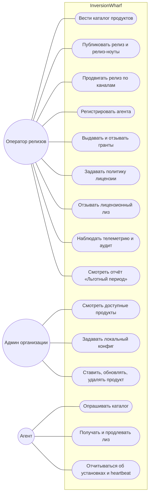

## 1.7 Предметная область (глоссарий)

| Термин | Значение |
| --- | --- |
| Tenant (организация) | Клиент-организация, владелец агентов |
| Product | Поставляемый продукт (набор микросервисов) |
| Release | Версионированный релиз: semver, канал, compose-шаблон, схема конфига, образы, подписи, SBOM, релиз-ноуты |
| Channel | Канал стабильности: `stable` / `beta` / `edge` |
| Image | Docker-образ релиза, фиксируемый по содержимому (digest) |
| Agent (апплайанс) | Go-демон на сервере клиента: логика взаимодействия с Control Plane и управление установкой продуктов через Docker Engine/containerd |
| Grant | Право установки и использования: «продукт доступен организации/агенту» с каналом и сроком; основание для выдачи лицензионного лиза |
| Installation | Фактически установленный продукт/версия (наблюдаемое состояние, сообщённое агентом) |
| Release notes | Changelog релиза: список изменений, привязанный к версии; неизменяем |
| License lease (лицензионный лиз) | Подписанный короткоживущий токен-разрешение на работу продукта, выдаётся под действующий грант; продлевается, пока грант действует (§2.15) |
| License Module | Встроенный в продукт модуль рантайм-проверки лицензии: `license-sidecar` (получение/продление лиза) + `License SDK` (принуждение в каждом сервисе) (§2.15) |
| Enrollment | Регистрация: привязка агента к организации и выдача ему идентичности |

## 1.8 Доменная модель (концептуальная)

Ключевые сущности предметной области и связи между ними — на бизнес-уровне, без колонок и типов. Определения терминов — глоссарий §1.7. Полная **логическая модель БД** (все колонки, ключи, типы, сгруппированные по сервису-владельцу) вынесена в Раздел 2 — см. §2.3.

**Сущности:** Организация, Агент, Идентичность агента, Токен регистрации, Продукт, Релиз, Образ, Грант, Лицензия (политика), Лицензионный лиз, Установка.

**Связи между сущностями** (подпись ребра — кардинальность и роль; пунктир — опциональная связь):
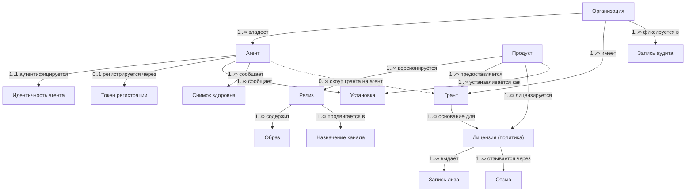

**Ключевые сущности и роли:**
- `РЕЛИЗ` — версионированный релиз продукта. Несёт compose-шаблон, схему конфига, образы (с дайджестом), подписи, SBOM и **релиз-ноуты** (`B2`).
- `ГРАНТ` — связь «продукт доступен». Скоуп: на всю организацию или на конкретный агент. Несёт разрешённый канал и срок (`B4`). Это основание для рантайм-лицензии: пока грант действует, продукту выдаётся лицензионный лиз (`B9`; лицензионная трактовка — §3.7).
- `ЛИЦЕНЗИЯ` — политика лицензирования продукта/гранта: TTL лиза, льготный период (по умолчанию 7 дней — §2.15), режим `HardStop`, лимит инстансов.
- `УСТАНОВКА` — **наблюдаемое** состояние: что агент *сообщил* как установленное (продукт, версия, здоровье, состояние лицензии). Это не «желаемое» состояние — Control Plane его не задаёт.

**Бизнес-инварианты:**
- `РЕЛИЗ.версия` уникальна в пределах продукта; релиз неизменяем после публикации (включая релиз-ноуты).
- `ОБРАЗ.дайджест` обязателен; запуск — только при совпадении дайджеста и валидной подписи (контроль целостности — §3.6).
- Агент может установить продукт, только если у его организации (или у него лично) есть действующий `ГРАНТ` на продукт и канал.
- `ТОКЕН_РЕГИСТРАЦИИ` одноразовый, с коротким сроком; идентичность агента выдаётся ровно один раз на агент.

## 1.9 Состояния и жизненные циклы

### Установка на агенте (отражается в отчётах)
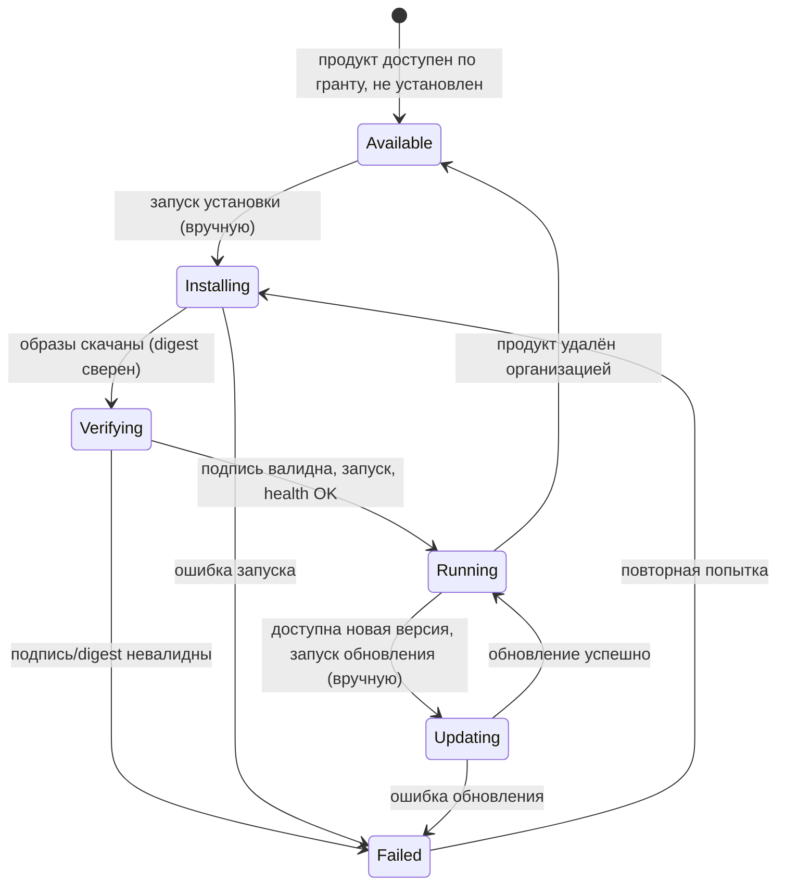
Все переходы инициирует **организация в агенте вручную**. Control Plane их не инициирует — только получает отчёты и хранит последний срез.

### Прочие жизненные циклы
Те же статусы, что и выше, но в виде диаграмм; переходы подписаны по-русски.

**Агент (Agent)**
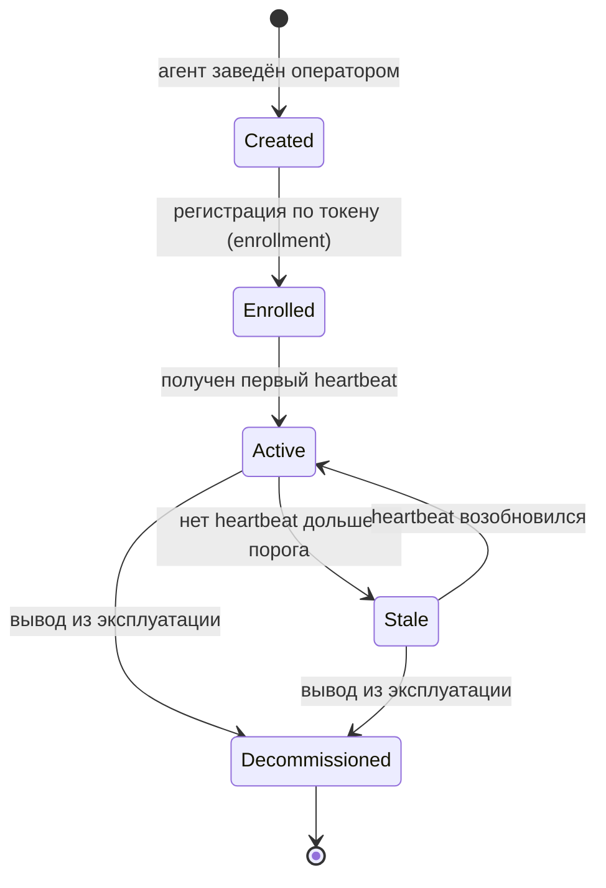

**Релиз (Release)**
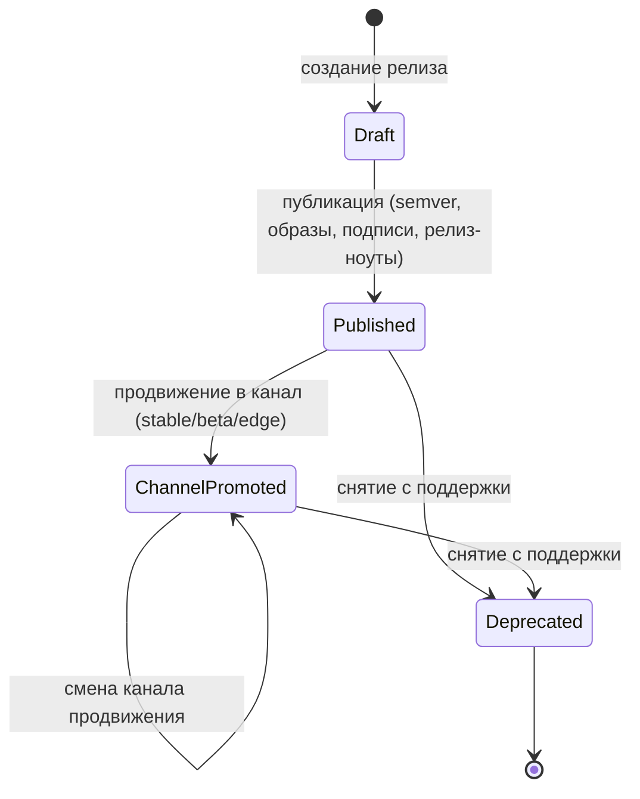

**Грант (Grant)**
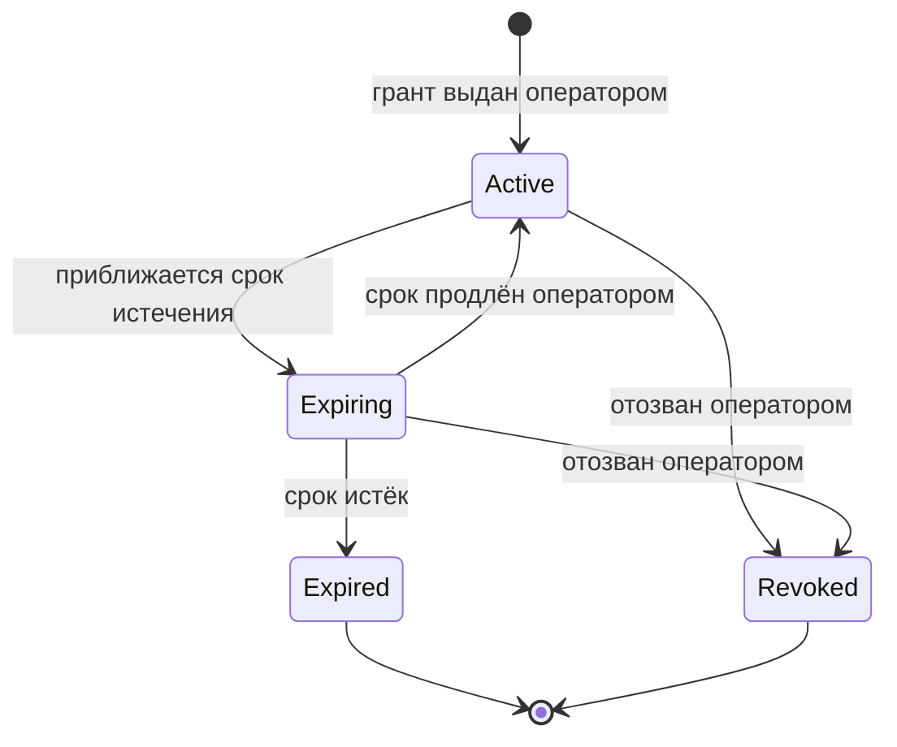
При истечении/отзыве продукт исчезает из доступных; уже установленное продолжает работать **в течение льготного периода лицензионного лиза (7 дней)**, затем останавливается, если лиз не продлён (рантайм-лицензирование — §2.15, §3.7).

**Лицензионный лиз (License lease)**
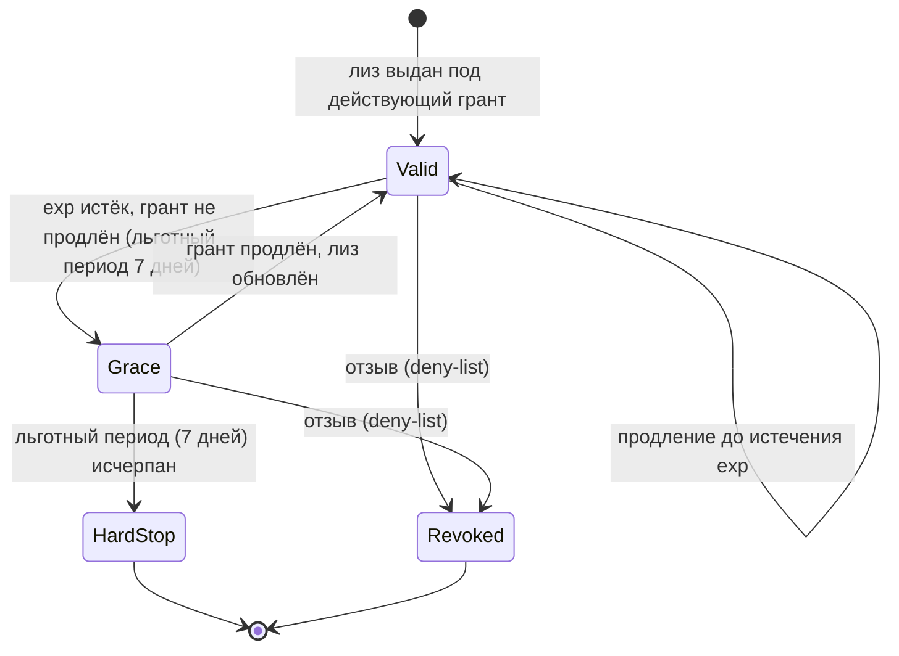
Лиз выдаётся под действующий грант, имеет короткий TTL и продлевается, пока грант действует. В состоянии `Grace` продукт продолжает работать, а оператору видно, сколько дней и какой продукт у какой организации работает в льготном режиме (§2.15, §2.13).

**Токен регистрации (EnrollmentToken)**
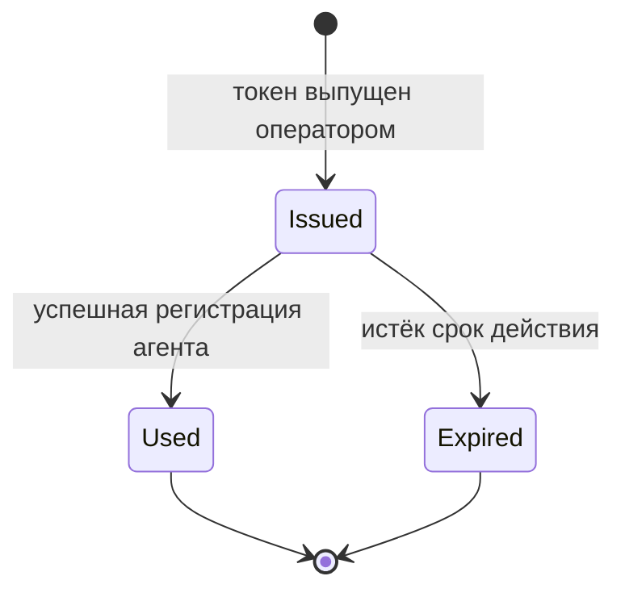

## 1.10 Ключевые сценарии (бизнес-описание)
Технические последовательности этих сценариев — в §2.9 с теми же идентификаторами.

- **`S1` Установка апплайанса и регистрация.** Оператор регистрирует агента и передаёт организации установщик и одноразовый токен. Организация ставит апплайанс и вводит токен — агент получает идентичность и доступ к реестру образов.
- **`S2` Публикация релиза и продвижение по каналам.** Оператор публикует релиз (образы, compose, схема конфига, релиз-ноуты), затем продвигает его в канал (`stable`/`beta`/`edge`).
- **`S3` Выдача гранта доступа.** Оператор связывает продукт с организацией или конкретным агентом, указывая канал и срок. С этого момента продукт появляется в списке доступного (`B4`).
- **`S4` Опрос каталога и ручная установка/обновление.** Агент по расписанию узнаёт список доступного; админ организации просматривает версии и релиз-ноуты, задаёт локальный конфиг и вручную запускает установку/обновление/удаление (`B5`).
- **`S5` Локальный конфиг и отчётность.** Значения конфигурации задаёт организация локально по схеме из каталога; после операции агент отчитывается о фактическом состоянии (`B7`).
- **`S7` Проверка лицензии в рантайме и льготный период.** Лицензионный модуль внутри продукта получает и заблаговременно продлевает короткоживущий подписанный лиз через агента (под действующий грант). Когда грант/лицензия заканчивается, продукт **не отключается сразу** — активируется **льготный период (по умолчанию 7 дней)**, в течение которого продукт у организации продолжает работать. Всё это время оператору вендора видно, **сколько дней осталось, по какому продукту и у какой организации** используется льготный режим. Если за 7 дней лиз не продлён — продукт прекращает обслуживание (`B9`).

## 1.11 Инварианты поведения
1. **Pull-only, online.** Control Plane никогда не инициирует входящее соединение к серверу клиента; всё взаимодействие — исходящие запросы агента.
2. **Инициатива на стороне клиента.** Установку/обновление запускает организация вручную, а не Control Plane.
3. **Целостность поставки.** Образ применяется, только если его digest совпадает с заявленным и подпись валидна (§3.6).
4. **Изоляция арендаторов.** Агент видит только гранты своей организации (§3.5).
5. **Деградация вместо отказа.** Сбой вспомогательной зависимости ведёт к деградации (последний список, кэш), а не к обрыву.
6. **Прослеживаемость.** Все операторские действия и enrollment'ы фиксируются в неизменяемом аудите; агенты отчитываются о фактических установках (§3.8).
7. **Рантайм-лицензирование.** Продукт обслуживает запросы только при действующем лицензионном лизе; по истечении грейс-периода без продления — останавливается. Грейс покрывает кратковременные сбои Control Plane (согласуется с инвариантом 5), но не бессрочную работу без продления (§2.15, §3.7).

---

# Раздел 2. Реализация

Для каждой возможности (`B1…B9`) и сценария (`S1…S5`, `S7`) из Раздела 1 ниже указано, как и на какой технологии это сделано.

## 2.1 Технологическая стратегия (главный принцип)
> **Принцип:** всё, что разумно реализуется на **Java/Spring**, реализуется на Java/Spring. Остальное — на специализированной технологии, наиболее подходящей под задачу.

**На Java/Spring** — вся бизнес-логика Control Plane: доменные сервисы, периметр (gateway), идентификация операторов, BFF для Dashboard. Стек: **Java 21, Spring Boot 3.5.x, Spring Cloud, Spring Security / Authorization Server, Spring Data JPA, Spring Cloud Stream (Kafka), Resilience4j, Spring Cloud Config/Vault, Spring Cloud Gateway**.

**Намеренно не на Java (с обоснованием):**

| Технология | Зачем | Почему не Java/Spring |
| --- | --- | --- |
| Агент-апплайанс — Go | Реализует `B5` (установка/обновление на сервере клиента) | Демон — статический Go-бинарь (ноль JVM-зависимостей, мгновенный старт, кросс-компиляция). Управляет Docker Engine на хосте через Docker socket; **не вендорит runtime** — требует Docker Engine ≥ 24 как предусловие |
| License SDK — на языке сервиса продукта (Go/Java/Node) | Рантайм-проверка лицензии внутри каждого сервиса продукта (`B9`, §2.15) | Должен линковаться в сам сервис на его языке и проверять подпись лиза **офлайн**; license-service на стороне CP — на Java/Spring |
| Harbor | Реестр Docker-образов (`B1`, `B6`) | Зрелый CNCF-продукт: RBAC, robot-аккаунты, репликация, сканирование |
| cosign / Sigstore | Подпись/проверка образов (`B6`) | Отраслевой стандарт supply-chain; проверка на агенте без JVM |
| HashiCorp Vault | Секреты + PKI (см. §3.4) | Специализированное хранилище и центр сертификации |
| Apache Kafka | Событийная шина (`B7`) | Durable-стриминг телеметрии и событий |
| Redis | Распределённый кэш / rate-limit | Низколатентный shared-state |
| PostgreSQL | Хранилище | Реляционная БД с транзакциями и JSONB |
| Kubernetes + Helm + Terraform | Оркестрация и IaC | Платформенный слой, не прикладной код |
| Prometheus / Grafana / Loki / OpenTelemetry / Tempo | Наблюдаемость | Отраслевой стек метрик/логов/трейсов |
| React/TypeScript | Dashboard (`B8`) | Клиентский UI; серверная часть (BFF) — Spring |

## 2.2 Архитектура

### Контекст (C4 L1)
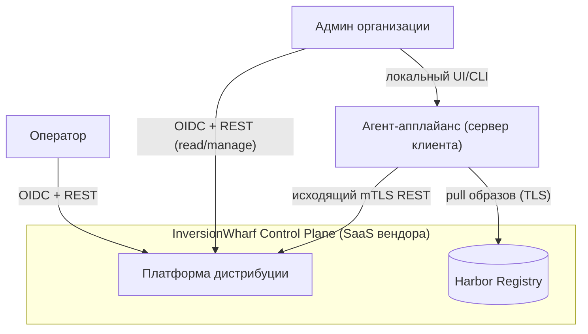

### Контейнеры (C4 L2)
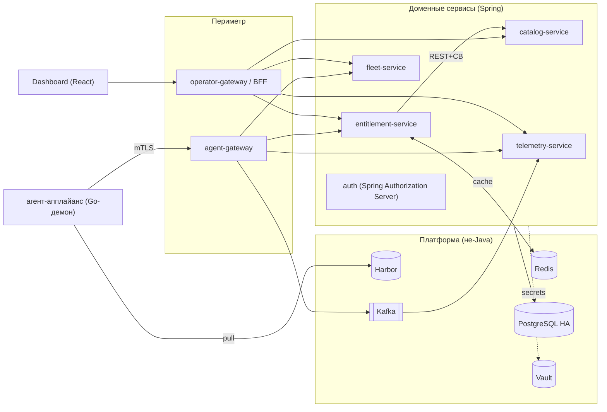

### Инвентарь компонентов (с привязкой к возможностям §1.4)

| Компонент | Технология | Реализует | Назначение |
| --- | --- | --- | --- |
| agent-gateway | Spring Cloud Gateway | `B5`,`B7` | Периметр для агентов: терминация mTLS, маппинг в принципал, rate-limit, публикация телеметрии в Kafka |
| operator-gateway / BFF | Spring Cloud Gateway + BFF | `B8` | Периметр для Dashboard / Operator API (OIDC) |
| auth | Spring Authorization Server | — (см. §3.2) | OAuth2/OIDC для людей, client-credentials для сервисов, федерация с IdP |
| catalog-service | Spring Boot | `B1`,`B2` | Продукты, релизы, каналы, образы, compose-шаблоны, схемы конфига, релиз-ноуты |
| fleet-service | Spring Boot | `B3` | Организации, агенты, enrollment, идентичности, heartbeat |
| entitlement-service | Spring Boot | `B4`,`B5` | Гранты «продукт↔организация/агент»; агентский read-API «что мне доступно» |
| license-service | Spring Boot | `B9` | Выпуск/продление/отзыв лицензионных лизов на основе действующих грантов; подпись лиза |
| telemetry-service | Spring Boot + Kafka | `B7` | Приём отчётов об установках и heartbeat, состояние флота, аудит |
| агент-апплайанс | Go | `B5`,`B6`,`B9` | Установка/обновление продуктов через Docker socket, отчёт; ретрансляция лицензионных лизов в продукт |
| License Module (license-sidecar + License SDK) | контейнер вендора + библиотека на языке сервиса | `B9` | Рантайм-проверка лицензии внутри продукта (§2.15) |
| Harbor | Harbor | `B1`,`B6` | Приватный реестр образов: RBAC, robot-аккаунты, репликация, сканирование |
| Vault | HashiCorp Vault | см. §3.4 | Секреты at-rest + PKI (CA для mTLS агентов) |
| Kafka | Apache Kafka | `B7` | Событийная шина: телеметрия, домен-события, аудит |
| Redis | Redis | `B5` | Распределённый кэш агентского read-API, токен-бакеты rate-limit |
| PostgreSQL | PostgreSQL (HA) | все | Реляционное хранилище доменных сервисов |
| Dashboard | React/TypeScript | `B8` | UI оператора и админа организации |

## 2.3 Владение данными
Каждый агрегат принадлежит одному сервису; межсервисный доступ — только через API/события. Межагрегатные ссылки между сервисами хранятся как идентификаторы, не как FK.

| Агрегат | Владелец |
| --- | --- |
| OAuth-клиенты, сессии, ключи подписи токенов | auth |
| Product, Release, Image, ChannelAssignment, ConfigSchema, ReleaseNotes | catalog-service |
| Tenant, Agent, AgentIdentity, EnrollmentToken | fleet-service |
| Grant (продукт↔организация/агент) | entitlement-service |
| License (политика), LeaseRecord (выданные лизы), ключи подписи лиза | license-service |
| Installation (отчёт агента), HealthSnapshot, AuditRecord | telemetry-service |

### Логическая модель данных (таблицы и колонки)
Логическая модель БД: все таблицы со всеми колонками, первичными (`PK`) и внешними (`FK`) ключами. Названия русские (СУБД-независимый уровень). Концептуальная модель и связи между сущностями — §1.8; схема-на-сервис и миграции Flyway — §2.5.

#### fleet-service
**ОРГАНИЗАЦИЯ**

| Колонка | Тип | Ключ | Комментарий |
| --- | --- | --- | --- |
| ид | uuid | PK | идентификатор организации |
| наименование | text |  | название клиента |
| инн | text |  | реквизит организации |
| статус | text |  | `Active` / `Suspended` |
| создана | timestamptz |  | момент регистрации |

**АГЕНТ**

| Колонка | Тип | Ключ | Комментарий |
| --- | --- | --- | --- |
| ид | uuid | PK | идентификатор агента |
| ид_организации | uuid | FK → ОРГАНИЗАЦИЯ | владелец |
| имя_хоста | text |  | хост сервера клиента |
| версия_апплайанса | text |  | текущая версия демона |
| статус | text |  | `Created`/`Enrolled`/`Active`/`Stale`/`Decommissioned` |
| последняя_активность | timestamptz |  | время последнего heartbeat |
| создан | timestamptz |  | момент заведения |

**ИДЕНТИЧНОСТЬ_АГЕНТА**

| Колонка | Тип | Ключ | Комментарий |
| --- | --- | --- | --- |
| ид | uuid | PK |  |
| ид_агента | uuid | FK → АГЕНТ | владелец идентичности |
| серийный_номер_сертификата | text |  | mTLS-сертификат (Vault PKI) |
| действителен_до | timestamptz |  | срок сертификата |
| статус | text |  | `Active` / `Revoked` |

**ТОКЕН_РЕГИСТРАЦИИ**

| Колонка | Тип | Ключ | Комментарий |
| --- | --- | --- | --- |
| ид | uuid | PK |  |
| ид_агента | uuid | FK → АГЕНТ | для какого агента выпущен |
| хеш_токена | text |  | хранится только хеш |
| статус | text |  | `Issued` / `Used` / `Expired` |
| истекает | timestamptz |  | короткий TTL (одноразовый) |

#### catalog-service
**ПРОДУКТ**

| Колонка | Тип | Ключ | Комментарий |
| --- | --- | --- | --- |
| ид | uuid | PK |  |
| слаг | text |  | уникальный машинный код продукта |
| наименование | text |  | отображаемое имя |
| описание | text |  | краткое описание |
| создан | timestamptz |  |  |

**РЕЛИЗ**

| Колонка | Тип | Ключ | Комментарий |
| --- | --- | --- | --- |
| ид | uuid | PK |  |
| ид_продукта | uuid | FK → ПРОДУКТ | к какому продукту |
| версия | text |  | semver, уникальна в пределах продукта |
| канал | text |  | `stable` / `beta` / `edge` |
| шаблон_compose | text |  | compose-шаблон релиза |
| схема_конфига | jsonb |  | схема локального конфига |
| релиз_ноуты | jsonb |  | changelog (`B2`), неизменяем |
| ссылка_sbom | text |  | ссылка на SBOM |
| подписан | boolean |  | наличие валидной cosign-подписи |
| статус | text |  | `Draft`/`Published`/`ChannelPromoted`/`Deprecated` |
| опубликован | timestamptz |  | момент публикации |

**ОБРАЗ**

| Колонка | Тип | Ключ | Комментарий |
| --- | --- | --- | --- |
| ид | uuid | PK |  |
| ид_релиза | uuid | FK → РЕЛИЗ | к какому релизу |
| репозиторий | text |  | путь в Harbor |
| тег | text |  | тег образа |
| дайджест | text |  | фиксация по содержимому (обязателен) |
| ссылка_подписи | text |  | cosign-подпись |

**НАЗНАЧЕНИЕ_КАНАЛА**

| Колонка | Тип | Ключ | Комментарий |
| --- | --- | --- | --- |
| ид | uuid | PK |  |
| ид_релиза | uuid | FK → РЕЛИЗ | продвигаемый релиз |
| канал | text |  | целевой канал |
| продвинут | timestamptz |  | момент продвижения |

#### entitlement-service
**ГРАНТ**

| Колонка | Тип | Ключ | Комментарий |
| --- | --- | --- | --- |
| ид | uuid | PK |  |
| ид_организации | uuid | FK → ОРГАНИЗАЦИЯ | кому выдан |
| ид_продукта | uuid | FK → ПРОДУКТ | на какой продукт |
| ид_агента | uuid | FK → АГЕНТ (опц.) | скоуп на агент; пусто = на всю организацию |
| канал | text |  | разрешённый канал |
| статус | text |  | `Active`/`Expiring`/`Expired`/`Revoked` |
| истекает | timestamptz |  | срок действия права |
| создан | timestamptz |  |  |

#### license-service
**ЛИЦЕНЗИЯ** (политика)

| Колонка | Тип | Ключ | Комментарий |
| --- | --- | --- | --- |
| ид | uuid | PK |  |
| ид_гранта | uuid | FK → ГРАНТ | основание |
| ид_продукта | uuid | FK → ПРОДУКТ |  |
| ид_организации | uuid | FK → ОРГАНИЗАЦИЯ |  |
| ид_агента | uuid | FK → АГЕНТ (опц.) |  |
| ttl_лиза_часы | integer |  | TTL лиза (напр. 24–72) |
| грейс_дни | integer |  | льготный период, по умолчанию 7 (§2.15) |
| режим_hardstop | text |  | `deny` / `read-only` / `shutdown` |
| макс_инстансов | integer |  | лимит одновременных инстансов |
| статус | text |  | `Active` / `Revoked` |

**ЗАПИСЬ_ЛИЗА** (история выдач)

| Колонка | Тип | Ключ | Комментарий |
| --- | --- | --- | --- |
| ид | uuid | PK |  |
| ид_лицензии | uuid | FK → ЛИЦЕНЗИЯ |  |
| jti | text |  | идентификатор лиза (для deny-list) |
| ид_агента | uuid | FK → АГЕНТ | кому выдан |
| выдан | timestamptz |  | `iat` |
| истекает | timestamptz |  | `exp` (короткий TTL) |
| грейс_до | timestamptz |  | граница льготного периода (`exp` + грейс) |

**ОТЗЫВ** (deny-list)

| Колонка | Тип | Ключ | Комментарий |
| --- | --- | --- | --- |
| ид | uuid | PK |  |
| ид_лицензии | uuid | FK → ЛИЦЕНЗИЯ |  |
| jti | text |  | отзываемый лиз |
| причина | text |  | основание отзыва |
| отозван | timestamptz |  | момент отзыва |

#### telemetry-service
**УСТАНОВКА** (последний срез + история)

| Колонка | Тип | Ключ | Комментарий |
| --- | --- | --- | --- |
| ид | uuid | PK |  |
| ид_агента | uuid | FK → АГЕНТ | кто сообщил |
| ид_продукта | uuid | FK → ПРОДУКТ | что установлено |
| версия | text |  | установленная версия |
| здоровье | text |  | `Running`/`Failed`/… (health) |
| состояние_лицензии | text |  | `Valid`/`Grace`/`HardStop` (для отчёта оператору) |
| грейс_до | timestamptz |  | до какого момента действует льготный период |
| сообщено | timestamptz |  | время отчёта агента |

**СНИМОК_ЗДОРОВЬЯ**

| Колонка | Тип | Ключ | Комментарий |
| --- | --- | --- | --- |
| ид | uuid | PK |  |
| ид_агента | uuid | FK → АГЕНТ |  |
| показатели | jsonb |  | метрики здоровья |
| снято | timestamptz |  |  |

**ЗАПИСЬ_АУДИТА** (append-only)

| Колонка | Тип | Ключ | Комментарий |
| --- | --- | --- | --- |
| ид | uuid | PK |  |
| ид_организации | uuid | FK → ОРГАНИЗАЦИЯ (опц.) | контекст арендатора |
| ид_агента | uuid | FK → АГЕНТ (опц.) | контекст агента |
| актор | text |  | кто совершил действие |
| действие | text |  | тип операторского действия / enrollment |
| детали | jsonb |  | полезная нагрузка события |
| совершено | timestamptz |  |  |

## 2.4 Стили взаимодействия и топология
- **Синхронные вызовы (REST).** Внутренние domain-to-domain — REST/JSON через Spring `RestClient`/OpenFeign под защитой Resilience4j (CB, retry, bulkhead, timeout). Agent↔CP — HTTPS REST поверх mTLS (исходящий, проходит firewall/NAT; реализует инвариант pull-only §1.11).
- **Асинхронные события (Kafka).** Шина для высокочастотных и аудируемых потоков (`B7`):

| Топик | Producer | Consumer | Содержание |
| --- | --- | --- | --- |
| `fleet.heartbeat` | agent-gateway | telemetry-service | Heartbeat агентов |
| `agent.installation.reported` | agent-gateway | telemetry-service | Отчёт об установленных продуктах/версиях (сценарий `S5`) |
| `catalog.release.published` | catalog-service | telemetry-service | Публикация нового релиза (сценарий `S2`) |
| `entitlement.grant.status.changed` | entitlement-service | fleet-service, агент (сигнал через опрос) | Смена статуса гранта (`Expired`/`Revoked`) → fleet-service сужает Harbor scope, агент запускает cleanup образов |
| `audit.operator.action` | все сервисы | telemetry-service | Неизменяемый аудит (§3.8) |

Сообщения версионируются (schema registry, Avro/JSON Schema); доставка — at-least-once с идемпотентными консьюмерами.

- **Многоарендность и сеть.** Control Plane — мультитенантный SaaS; изоляция данных — на уровне tenant в каждом сервисе (§3.5). Развёртывание — Kubernetes; intra-cluster трафик — через service mesh (опционально). Внешний трафик — через ingress → gateway.

## 2.5 Соглашения для Spring-сервисов
Пакетная структура: `web (controller) / service / domain (entity) / repository / dto / mapper / client (feign) / messaging (kafka) / config / exception`. БД — PostgreSQL, схема-на-сервис; миграции — **Flyway** (`V<n>__*.sql`), `ddl-auto=validate`, `open-in-view=false`. Идентификаторы — UUID; время — `timestamptz` (UTC). События — Spring Cloud Stream (Kafka), идемпотентные консьюмеры.

## 2.6 Сквозные механизмы (нефункциональные)
*(Механизмы безопасности вынесены в Раздел 3.)*
- **Конфигурация.** Несекретная — Spring Cloud Config Server, backend = Git (версионирование, аудит изменений). Профили окружений (`dev`/`staging`/`prod`); горячий рефреш через Spring Cloud Bus. Секреты — см. §3.4.
- **Обработка ошибок.** Единый формат — **RFC 7807 `application/problem+json`** (`type, title, status, detail, instance, traceId` + `errors[]`). В каждом сервисе — `@RestControllerAdvice`. Ошибки агентского контура несут машиночитаемый `code`. Карта кодов — §3.10.
- **Валидация.** Bean Validation на входящих DTO (`@Valid`); semver и канал — кастомные валидаторы; compose-шаблон и схема конфига — синтаксическая проверка при публикации релиза (`S2`).
- **Отказоустойчивость:**

| Паттерн | Реализация | Где |
| --- | --- | --- |
| API Gateway | Spring Cloud Gateway | периметр (agent + operator) |
| Service discovery | Kubernetes DNS + Spring Cloud LoadBalancer | внутрикластерно |
| Config Server | Spring Cloud Config (+ Bus) | конфигурация |
| Circuit Breaker / Retry / Bulkhead / TimeLimiter | Resilience4j | межсервисные вызовы |
| Rate limiting | Spring Cloud Gateway + Redis | агентский и операторский контур |
| Distributed cache | Redis | агентский read-API (stale-ok при сбое catalog) |
| Idempotency | ключи идемпотентности + идемпотентные консьюмеры Kafka | приём отчётов (`S5`) |
| Graceful degradation | агент держит последний список и работает офлайн (инвариант §1.11.5) | сервер клиента |

## 2.7 Микросервисы — детально

### auth (Spring Authorization Server)
OAuth2/OIDC-провайдер для операторов/админов и client-credentials для сервисов; JWKS, ротация ключей; федерация к внешнему IdP. Данные: registered clients, authorizations, consent, signing keys (ключи — в Vault). Подробности идентичности и токенов — §3.2–3.3.

### agent-gateway
Периметр агентского контура (`B5`,`B7`). Терминация mTLS, сопоставление сертификата с `AgentIdentity` (вызов fleet), чеканка внутреннего JWT, rate-limit (Redis), маршрутизация в entitlement/fleet/telemetry, публикация heartbeat и отчётов в Kafka. Строгая валидация цепочки и привязки cert→tenant/agent (§3.2).

### operator-gateway / BFF
Периметр UI/Operator API (`B8`): проверка OIDC-токенов, агрегация для Dashboard, CORS, rate-limit, корреляция трейсов.

### catalog-service (`B1`, `B2`)
- **Данные:** `product(slug uniq, name)`, `release(product_id, version, channel, compose_template, config_schema jsonb, release_notes jsonb, sbom_ref, signed) uniq(product_id, version)`, `image(release_id, repo, tag, digest, signature_ref)`, `channel_assignment(release_id, channel, promoted_at)`.
- **Поведение:** валидация semver/канала/compose/схемы конфига и захват релиз-ноутов при публикации; неизменяемость опубликованного релиза; событие `catalog.release.published` (`S2`).
- **Ошибки:** 409 (дубль версии), 422 (невалидный compose/схема), 404, 400.

### fleet-service (`B3`)
- **Данные:** `tenant`, `agent(tenant_id, hostname, appliance_version, last_seen, status)`, `agent_identity(agent_id, cert_serial, not_after, status)`, `enrollment_token(agent_id, token_hash, status, expires_at)`.
- **Поведение:** генерация **персонализированного установщика** (подписанный архив с вшитым `enrollmentToken` — токен не передаётся отдельно, §2.9 `S1`); при enrollment — подпись CSR через Vault PKI, выдача robot-кредов Harbor по scope tenant; отзыв идентичности при decommission. Консьюмер `entitlement.grant.status.changed`: при `Expired`/`Revoked` вызывает Harbor API → удаляет репозиторий отозванного продукта из scope robot-аккаунта tenant (`S1`; безопасность — §3.2, §3.4, §3.5).
- **Ошибки:** 409 (повтор токена), 410 (истёк), 404, 400.

### entitlement-service (`B4`, `B5`)
- **Данные:** `grant(tenant_id, product_id, agent_id nullable, channel, expires_at, status)`.
- **Внутреннее устройство:** `GrantService` (CRUD/проверка действительности); `AvailableProductsService` (по идентичности агента собирает действующие гранты, обогащает версиями/деталями/релиз-ноутами из catalog через `CatalogClient` Feign+CB, кэширует в Redis, флаг `stale` при fallback) — это и есть API «что мне доступно» для `S4`. При переходе гранта в `Expired` или `Revoked` публикует событие `entitlement.grant.status.changed` (productId, tenantId, agentId?, newStatus) в Kafka.
- **Ошибки:** 403 (нет действующего гранта), 404, 503 (CB без кэша), 400.

### license-service (`B9`)
- **Назначение:** выпуск и продление **лицензионных лизов** на основе действующих грантов; срочный отзыв. Сервер-сторона рантайм-лицензирования; детали модуля в продукте — §2.15.
- **Данные:** `license(grant_id, product_id, tenant_id, agent_id, policy jsonb {ttl, grace_days=7, hardstop_mode, max_instances}, status)`, `lease_record(license_id, jti, agent_id, issued_at, expires_at, grace_until)` (история выдач; `grace_until = expires_at + grace_days`), `revocation(jti|license_id, reason, at)` (deny-list). Приватный ключ подписи лиза — в Vault (§3.4).
- **API:** `/v1/licenses/lease` (через agent-gateway, `S7`); операторские `/api/products/{id}/license-policy`, `/api/licenses/{id}/revoke` (§2.10).
- **Поведение:** при запросе лиза проверяет действующий грант через entitlement (Feign+CB), чеканит подписанный короткоживущий лиз, пишет аудит выдачи и проверяет deny-list. Короткий TTL лиза + грейс на стороне продукта позволяют переживать недоступность license-service (деградация вместо отказа — инвариант §1.11.5).
- **Ошибки:** 403 `LICENSE_DENIED` (нет действующего гранта/отозвано), 404, 503 (CB без кэша), 400.

### telemetry-service (`B7`)
- **Данные:** `installation(agent_id, product_id, version, health, license_state, grace_until, reported_at)` (последний срез + история; `license_state` ∈ `Valid`/`Grace`/`HardStop`, `grace_until` — до какого момента действует льготный период), `health_snapshot`, `audit_record` (append-only). Ретеншн/downsampling по политике.
- **Поведение:** материализует актуальное состояние установок по агентам/продуктам; считает метрики флота (включая долю продуктов в `Grace`/`HardStop`); экспорт в Prometheus.
- **Отчёт по льготному периоду (для оператора).** Сводит установки в состоянии `Grace` в отчёт: организация, продукт, агент, дата начала льготного периода и **сколько дней осталось** (`grace_until − now`, из `installation` и `lease_record.grace_until` license-service). Источник для дашборда §2.13 и Operator API `GET /api/licenses/grace` (§2.10).

## 2.8 Агент-апплайанс (Go) — реализация `B5`, `B6`, `B9`
Go-демон на сервере клиента, работающий поверх установленного Docker Engine (≥ 24) или containerd (≥ 1.7) с плагином Compose v2. Организация ставит один пакет — Docker Engine должен быть установлен и работать до запуска апплайанса.

- **Состав поставки (installer):** **Персонализированный** подписанный архив: Go-демон + enrollment-токен (вшит при генерации в Dashboard, не передаётся в открытом виде отдельно) + локальный CLI и web-UI + systemd-юниты (жизненный цикл демона). Installer проверяет наличие и версию Docker Engine; при несоответствии завершается с диагностикой. Enrollment запускается автоматически при первом старте — вводить токен вручную не нужно.
- **Предусловия на хосте:** поддерживаемый Linux (x86_64/arm64), systemd, root для установки, **Docker Engine ≥ 24 (или containerd ≥ 1.7 + плагин Compose v2)**, запущенный Docker socket (`/var/run/docker.sock`).
- **Компоненты демона:**
  - `Enrollment` — token → CSR → получение mTLS-идентичности и robot-кредов Harbor (`S1`).
  - `RuntimeManager` — проверка версии и доступности Docker socket; управление compose-проектами через Docker API.
  - `CleanupManager` — при переходе гранта в `Expired`/`Revoked` или при фиксации `HardStop` лиза вызывает `docker image rm` для всех образов соответствующего продукта. Исключает запуск кэшированных образов в обход агента после утраты права (§3.9).
  - `CatalogPoller` — по локальному расписанию опрашивает `GET /v1/products`, кэширует доступные продукты, версии и релиз-ноуты (`S4`). Обнаружение исчезнувшего гранта (продукт пропал из ответа) — сигнал для `CleanupManager`.
  - `LocalUI` — локальный web-UI/CLI: показывает доступное и релиз-ноуты, принимает локальный конфиг и **ручной запуск** установки/обновления/удаления (`B5`, `S4`).
  - `Installer` — render compose из шаблона + локальный конфиг (`S5`), `compose pull` по digest, `compose up -d`, health-check.
  - `Verifier` — `cosign verify` и pin по digest перед запуском (`B6`, §3.6).
  - `Reporter` — отчёт об установках (`POST /v1/installations`) и heartbeat.
  - `LicenseAgent` — принимает запросы лиза от `license-sidecar` продукта по localhost, форвардит в license-service через agent-gateway (mTLS), кэширует последний лиз для офлайн-выдачи в пределах его TTL/grace (`B9`, `S7`, §2.15).
  - `SelfUpdater` — обновление демона апплайанса по политике.
- **Поведение:** исходящий mTLS REST к agent-gateway; локальное персистентное состояние; backoff/retry; при недоступности CP работает на последнем списке (деградация вместо отказа — инвариант §1.11.5). Инициатива установки/обновления — **ручная**, не от CP (инвариант §1.11).

## 2.9 Реализация ключевых сценариев

### `S1` Установка апплайанса и enrollment (mTLS)
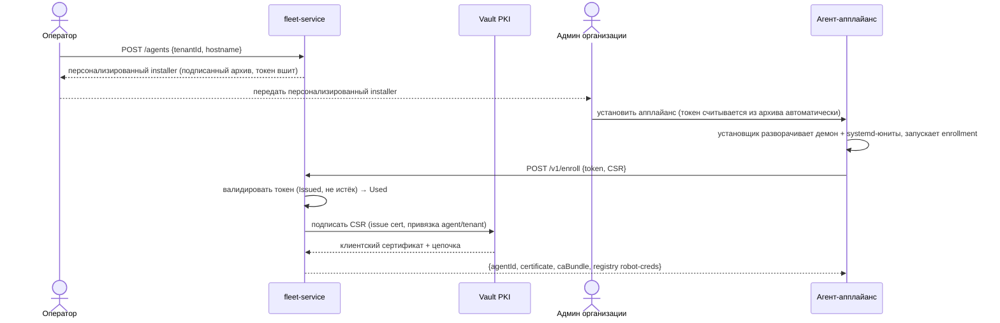

### `S2` Публикация релиза и продвижение по каналам
Оператор пушит образы в Harbor → подписывает cosign → `POST /products/{id}/releases` (catalog проверяет semver, compose, схему конфига, наличие digest/подписи, сохраняет релиз-ноуты) → `POST /releases/{id}/promote {channel}`. Событие `catalog.release.published` уходит в Kafka.

### `S4` Опрос каталога и ручная установка
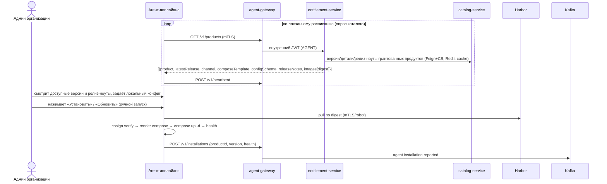
Опрос каталога идёт по расписанию (для получения списка доступного); **установку/обновление запускает только админ организации вручную**.

### `S7` Получение лиза и проверка лицензии в рантайме
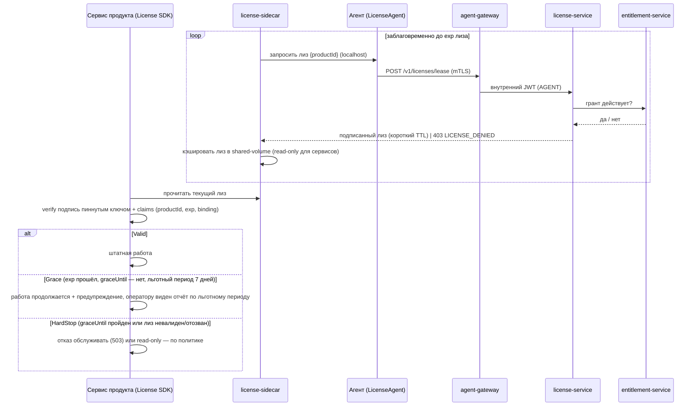
Лиз продлевается, только пока действует грант; без агента (или после отзыва гранта) продление невозможно → по истечении TTL+grace продукт переходит в `HardStop`. Подробности модуля — §2.15.

## 2.10 Контракты API
Базовые контуры: **agent-gateway** (`/v1/...`, mTLS) и **operator-gateway** (`/api/...`, OIDC). Ошибки — `problem+json` (§3.10).

### Agent API (agent-gateway, mTLS)

| Метод | Путь | Назначение |
| --- | --- | --- |
| POST | `/v1/enroll` | Enrollment по токену + CSR → mTLS-идентичность (`S1`) |
| GET | `/v1/products` | Доступные агенту продукты, версии, compose-шаблоны, схемы конфига, релиз-ноуты, образы (`S4`) |
| POST | `/v1/installations` | Отчёт о фактически установленных/обновлённых продуктах (`S5`) |
| POST | `/v1/heartbeat` | Heartbeat без изменений |
| POST | `/v1/licenses/lease` | Получение/продление лицензионного лиза (через `LicenseAgent`, `S7`, `B9`) |

### Operator API (operator-gateway, OIDC)

| Группа | Эндпоинты |
| --- | --- |
| catalog | `POST/GET /api/products`, `POST/GET /api/products/{id}/releases`, `POST /api/releases/{id}/promote` |
| fleet | `POST/GET /api/tenants`, `POST/GET /api/agents`, `GET /api/agents/{id}` |
| grants | `POST/GET /api/tenants/{id}/grants`, `DELETE /api/grants/{id}` |
| licenses | `GET/PUT /api/products/{id}/license-policy` (TTL, грейс в днях — по умолчанию 7, режим HardStop, maxInstances), `POST /api/licenses/{id}/revoke`, `GET /api/licenses/grace` (отчёт: организация, продукт, агент, дней до конца льготного периода) (`B9`) |
| telemetry | `GET /api/fleet/health`, `GET /api/agents/{id}/installations`, `GET /api/audit` |

### Внутренние (Feign) контракты

| Вызывающий | Цель | Эндпоинт |
| --- | --- | --- |
| entitlement-service | catalog-service | `GET /internal/products/{id}/releases?channel=` |
| license-service | entitlement-service | `GET /internal/grants/active?tenantId=&agentId=&productId=` (проверка действительности гранта перед выдачей лиза) |
| license-service | Vault | подпись лицензионного лиза (ключ подписи) |
| fleet-service | Vault PKI | issue certificate (подпись CSR) |
| agent-gateway | fleet-service | `GET /internal/identities/resolve` (cert → принципал) |

Пример `GET /v1/products`:
```json
{
  "agentId": "9f...", "generatedAt": "2026-06-22T12:00:00Z", "stale": false,
  "products": [{
    "product": "invopay", "channel": "stable",
    "latestRelease": "2.3.1",
    "releaseNotes": [
      "Прямая маршрутизация переводов через корсчета банков, минуя СБП.",
      "Поддержка формата сообщений ISO 20022 (pacs.008 / pacs.002)."
    ],
    "composeTemplate": "services: ...",
    "configSchema": { "BANK_BIC": { "type": "string", "required": true } },
    "images": [{ "repo": "harbor/invopay/gateway", "digest": "sha256:abc...", "signature": "cosign://..." }]
  }]
}
```

## 2.11 Цепочка поставки образов (реализация)
- Образы хранятся в Harbor; обязателен pull по **digest** (`B1`).
- Релизы подписываются cosign при публикации (`S2`); агент проверяет подпись и digest до запуска (`Verifier`). Политика безопасности supply-chain — §3.6.
- SBOM формируется при публикации; Harbor сканирует CVE; репликация Harbor между регионами — по необходимости.

## 2.12 Инфраструктура и развёртывание

### Диаграмма развёртывания
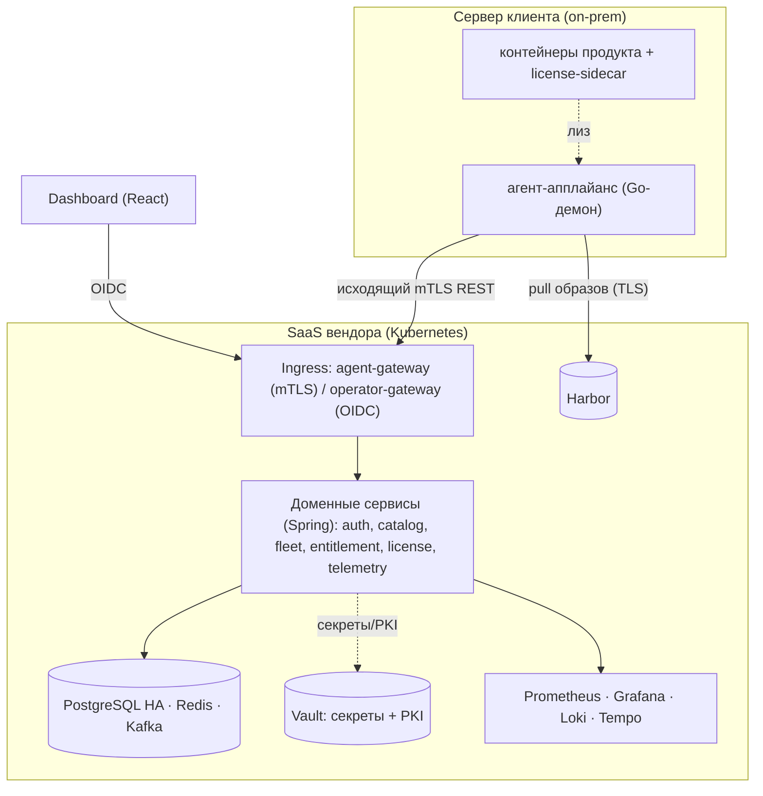

- **Оркестрация:** Kubernetes; пакетирование — Helm-чарты на сервис; окружения — values + Spring profiles.
- **IaC:** Terraform (кластер, Harbor, Vault, Kafka, Redis, PostgreSQL, сети, DNS, сертификаты).
- **Образы сервисов:** Spring Boot layered jar → OCI-образ (Buildpacks/Jib).
- **Периметр:** ingress + cert-manager; отдельные ingress для agent-gateway (mTLS) и operator-gateway (OIDC).
- **Данные:** PostgreSQL в HA (реплики, PITR); Kafka и Redis — кластерные; Vault — HA с auto-unseal.
- **Дистрибуция агента:** сборка апплайанса (daemon + вендоренный runtime) → подписанные пакеты (.deb/.rpm) и self-extracting installer; канал обновлений апплайанса.
- **CI/CD:** сборка → тесты → скан → подпись → push в Harbor → прогрессивный деплой Control Plane; миграции Flyway отдельным шагом.

## 2.13 Наблюдаемость (реализация `B7`)
- **OpenTelemetry** (Micrometer Tracing) — сквозные трейсы; `traceId` пробрасывается через gateway, REST и Kafka-заголовки.
- **Prometheus** — метрики; **Grafana** — дашборды; **Loki** — структурные логи (с `traceId`/`tenantId`); **Tempo/Jaeger** — трейсы.
- **Бизнес-метрики:** доля healthy-установок, распределение версий по флоту, число stale-агентов.
- **Дашборды:** здоровье установок, распределение версий, stale-агенты, latency/ошибки сервисов, состояние CB; выдача лизов и доля продуктов в `Grace`/`HardStop` (`B9`); **отдельный отчёт «Льготный период»** — список «организация · продукт · агент · осталось дней» для всех продуктов, работающих в льготном режиме (источник — §2.7 telemetry-service).
- **Алертинг:** рост Failed-установок, всплеск stale, открытые CB, отставание Kafka-консьюмеров, приближение истечения грантов/сертификатов; всплеск отказов `LICENSE_DENIED` и переходов продуктов в `Grace`/`HardStop`.

## 2.14 Нефункциональные требования

| Категория | Ориентир |
| --- | --- |
| Масштаб | сотни–тысячи агентов на инстанс CP |
| Интервал опроса каталога агентом | 30–300 с (настраивается организацией; установку запускает админ вручную) |
| Доступность CP | 99.9%, агенты переживают краткие простои (инвариант §1.11.5) |
| Совместимость хоста | Linux x86_64/arm64, systemd, Docker Engine ≥ 24 или containerd ≥ 1.7 |
| Хранение телеметрии | партиционирование + ретеншн/downsampling |

## 2.15 Лицензионный модуль продукта (License Module) — реализация `B9`
Принудительная проверка лицензии **в рантайме самого продукта**. Закрывает обход, при котором организация запускает образы напрямую, минуя агента и продление гранта (см. угрозу в §3.9): без действующего, подписанного, короткоживущего **лицензионного лиза** продукт после грейс-периода прекращает обслуживание. Серверная сторона — `license-service` (§2.7), сценарий — `S7` (§2.9).

### Состав (поставляется вместе с продуктом; образы вендора, пиннуются по digest и подписываются cosign — §3.6)
- **`license-sidecar`** — контейнер в compose-стеке продукта. Получает и заблаговременно продлевает лиз через локальный API агента (`LicenseAgent`, §2.8); кэширует подписанный лиз в shared-volume (read-only для сервисов). **Не содержит приватных ключей.**
- **`License SDK`** — библиотека, встроенная в каждый сервис продукта (на языке сервиса — Go/Java/Node). **Точка принуждения:** на старте и периодически читает лиз, **офлайн** проверяет подпись пиннутым публичным ключом вендора и клеймы, применяет состояние. Удаление сайдкара → лиз не продлевается → SDK останавливает сервис по истечении грейса; удаление SDK требует патча бинарей **каждого** сервиса.

### Лицензионный лиз (license lease)
Подписанный токен (JWS, Ed25519/RS256; приватный ключ — в Vault §3.4, публичный — пиннут в SDK). Claims — §3.3. Бинд к `agentId`/`tenantId` → лиз нельзя перенести в другую инсталляцию; короткий TTL → старый лиз быстро протухает; `jti` → одноразовость/деny-list.

### Состояния принуждения (в `License SDK`)
| Состояние | Условие | Поведение |
| --- | --- | --- |
| `Valid` | лиз валиден, `exp` не наступил | штатная работа |
| `Grace` | `exp` прошёл, но `graceUntil` — нет (льготный период, по умолчанию 7 дней) | продукт **продолжает работать** + предупреждение; параллельно оператору видно, сколько дней осталось, по какому продукту и у какой организации (§2.13); покрывает и кратковременные сбои CP/сети (инвариант §1.11.5) |
| `HardStop` | `graceUntil` пройден, либо лиз отсутствует/невалиден/отозван | отказ обслуживать (`503`) или режим read-only / shutdown — по политике продукта |

### Получение/продление (через агента — сохраняет pull-only)
`license-sidecar` → `LicenseAgent` (localhost) → agent-gateway (mTLS) → `license-service`, который проверяет действующий грант (entitlement) и чеканит лиз. Так лиз нельзя получить **без работающего агента и действующего гранта** — это и есть механизм принуждения к продлению.

### Политика (оператор задаёт per-product/grant, §2.10)
TTL лиза, **длительность льготного периода (грейса) — по умолчанию 7 дней**, режим `HardStop` (`deny`/`read-only`/`shutdown`), `maxInstances`. Подбираются так, чтобы легальный клиент переживал простои CP и сети, а неплатящий — гарантированно останавливался по истечении 7 дней.

### Видимость льготного периода для оператора
Пока продукт работает в состоянии `Grace`, это **не скрытый** режим: `license-sidecar`/`License SDK` сообщают `license_state=Grace` и `grace_until` в отчёте об установке (`S5`), а `license-service` хранит `grace_until` в `lease_record`. telemetry-service сводит это в отчёт «организация · продукт · агент · осталось дней» (Operator API `GET /api/licenses/grace`, дашборд §2.13). Так вендор в любой момент видит, **сколько дней, какого продукта и у какой организации** используется льготный режим, и может связаться с клиентом до жёсткой остановки.

### Отзыв
Быстрее всего — отказ в продлении (грант истёк/отозван) → естественное протухание после `TTL+grace`. Для срочного отзыва — deny-list по `jti`/`licenseId` на `license-service` + укорочение TTL.

### Остаточный риск (честно)
У организации root на хосте — теоретически можно пропатчить SDK/бинарь и снять проверку. Меры, повышающие планку: обфускация, self-integrity-check бинарей, проверка подписи образов при старте (cosign, §3.6), вынос части критичной логики/данных в серверный API вендора (SaaS-зависимость), аппаратная привязка (`bindingFingerprint`). 100%-защита кода на чужом железе недостижима — цель: сделать обход дороже легального продления и **заметным в аудите** (§3.8).

## 2.16 Открытые решения

| # | Вопрос | Текущее решение |
| --- | --- | --- |
| Q1 | gRPC vs REST для агента | REST/mTLS базово; gRPC — оптимизация для крупного флота |
| Q2 | Внешний IdP vs Spring Authorization Server | Spring Authorization Server с федерацией к корпоративному IdP |
| Q3 | Гранты на уровне организации или агента | Поддерживаются оба (скоуп гранта `TENANT`/`AGENT`) |
| Q4 | Встроенный runtime: вендоренный Docker vs требование установленного | **Решено:** Docker Engine ≥ 24 как предусловие; апплайанс runtime не вендорит |
| Q5 | Локальный конфиг продукта на агенте | Схема — из catalog (`config_schema`), значения задаёт организация локально |
| Q6 | Service mesh | опционально (Istio/Linkerd) для intra-cluster mTLS |
| Q7 | Режим `HardStop` по умолчанию | `read-only` (мягкий) — настраивается per-product; для критичных продуктов — `deny` |
| Q8 | Принуждение лицензии: только sidecar vs SDK в каждом сервисе | Оба: sidecar для продления + SDK как точка принуждения (устойчивее к обходу) |

---

# Раздел 3. Безопасность, лицензирование и доступ

Раздел опирается на акторов (§1.6), инварианты поведения (§1.11), компоненты реализации (§2.7, §2.8), цепочку поставки (§2.11) и лицензионный модуль (§2.15).

## 3.1 Принципы безопасности
- **Pull-only, исходящие соединения.** Control Plane не инициирует входящих подключений к серверу клиента (инвариант §1.11.1) — снижает поверхность атаки на стороне организации.
- **Zero-trust между сервисами.** Каждый сервис — resource server, проверяет токен независимо; внутрикластерный трафик — mesh-mTLS (опционально, §2.4).
- **Наименьшие привилегии.** Агент привязан к своему tenant/agent; robot-аккаунты Harbor — со scope только на разрешённые гранты (§3.5).
- **Integrity-first.** Без валидной подписи и совпадения digest продукт не запускается (§3.6, инвариант §1.11.3).
- **Принуждение лицензии в рантайме.** Право на использование проверяется не только при дистрибуции, но и при выполнении: без действующего лиза продукт останавливается после грейса (§3.7, §2.15, инвариант §1.11.7).
- **Прослеживаемость.** Неизменяемый аудит всех операторских действий и enrollment'ов (§3.8).

## 3.2 Идентификация и доступ
Сопоставление акторов из §1.6 с механизмами идентичности:

| Актор (§1.6) | Механизм | Реализует компонент |
| --- | --- | --- |
| Оператор релизов / Админ организации | OAuth2/OIDC, JWT (RS256), роли `OPERATOR` / `TENANT_ADMIN` (scope по tenant) | auth (§2.7), operator-gateway |
| Агент | mTLS-клиентский сертификат (Vault PKI); downstream — внутренний короткоживущий JWT с claims `AGENT`/`tenantId`/`agentId` | agent-gateway (§2.7), fleet-service |
| Сервис | OAuth2 client-credentials и/или mesh-mTLS | auth, service mesh |

- **Издатель токенов людей** — Spring Authorization Server (`auth`), с федерацией к корпоративному IdP; access-токены JWT (RS256), ротация ключей, JWKS.
- **Агенты.** agent-gateway терминирует mTLS, проверяет цепочку и сопоставляет сертификат с `AgentIdentity` (tenant, agent); отбраковывает отозванные сертификаты; для downstream-вызовов чеканит внутренний JWT с claims агента.
- **Авторизация.** Все сервисы — OAuth2 resource servers: проверка подписи (JWKS), срока и scope; авторизация — method-level (`@PreAuthorize`) и на gateway.

## 3.3 Токены и claims
- **Формат и срок.** Access-токены — JWT RS256 с коротким TTL; refresh-токены для UI; ротация ключей подписи, публикация через JWKS.
- **Внутренний токен агента.** Чеканится agent-gateway после успешного mTLS; короткоживущий; **привязан к сертификату** (claim `cnf`, cert-bound) — украденный токен бесполезен без соответствующего клиентского сертификата.

| Claim | Описание | Для кого |
| --- | --- | --- |
| `sub` | субъект (operator id / agent id / client id) | все |
| `roles`/`scope` | `OPERATOR` / `TENANT_ADMIN` / `AGENT` / `SERVICE` | все |
| `tenantId` | организация | агент, tenant-admin |
| `agentId` | агент | агент |
| `iat`/`exp` | выпуск/истечение | все |
| `cnf` | привязка к mTLS-сертификату (cert-bound) | агент |

### Лицензионный лиз (license lease) — claims
Отдельный подписанный токен рантайм-лицензирования (`B9`, §2.15), проверяется **офлайн** `License SDK` внутри продукта пиннутым публичным ключом вендора.

| Claim | Описание |
| --- | --- |
| `productId`, `channel` | продукт и разрешённый канал |
| `tenantId`, `agentId` | привязка к инсталляции (лиз нельзя перенести) |
| `licenseId` | ссылка на грант/лицензию (основание) |
| `entitlements` | включённые функции/лимиты продукта |
| `iat`, `nbf`, `exp` | выпуск / не ранее / истечение (короткий TTL, напр. 24–72 ч) |
| `graceUntil` | граница льготного периода после `exp` (по умолчанию `exp` + 7 дней) |
| `maxInstances` | максимум одновременных инстансов (опц.) |
| `bindingFingerprint` | привязка к хосту/железу (опц.) |
| `jti`, `iss` | идентификатор лиза (для deny-list) и издатель (`license-service`) |

## 3.4 Секреты и PKI
- **Vault** хранит креды БД/брокера, ключи подписи токенов (§3.3), **ключ подписи лицензионного лиза** (`license-service`, §2.7), robot-креды Harbor (§3.5). Интеграция Spring — через Spring Cloud Vault (Kubernetes auth).
- **Vault PKI** — центр сертификации (CA) для mTLS-идентичностей агентов (используется в `S1`, §2.9): сертификаты короткоживущие, ротация автоматическая, отзыв через короткий TTL/CRL.
- **Ключи лицензии.** Приватный ключ подписи лиза — только в Vault; публичный ключ верификации **пиннут в `License SDK`** и ротируется через обновление продукта. Компрометация приватного ключа → ротация + deny-list ранее выданных лизов.
- **Гигиена секретов.** Секреты не попадают в Git или образы в открытом виде; несекретная конфигурация — в Config Server (§2.6).

## 3.5 Многоарендность и изоляция
- Изоляция данных — на уровне tenant в каждом сервисе (владение данными — §2.3); запросы агента ограничены его tenant (инвариант §1.11.4).
- **Реестр (Harbor):** на каждый tenant — robot-аккаунты со scope только на продукты, разрешённые грантами (§3.7). Агент не может вытянуть образ продукта, на который у организации нет гранта. При истечении или отзыве гранта fleet-service **автоматически** сужает scope robot-аккаунта — убирает репозиторий отозванного продукта; pull новых образов этого продукта становится невозможен немедленно. Уже скачанные образы удаляются агентом через `CleanupManager` (§2.8).
- Проверка действительности гранта выполняется в entitlement-service при формировании списка доступного (`S4`).

## 3.6 Целостность и происхождение поставки (supply-chain security)
Реализует возможность `B6` (§1.4) поверх механики §2.11.
- Релизы подписываются **cosign**; на агенте — **обязательная** проверка подписи и pin по digest перед запуском (иначе `Verifying → Failed`, §1.9). Неподписанный релиз установить нельзя.
- **SBOM** формируется и хранится при публикации; Harbor сканирует CVE; политика может пометить релиз небезопасным — агенту отдаётся флаг, **решение об установке остаётся за организацией** (инициатива у клиента, §1.11.2).
- Образ тянется только по содержимому (digest), что исключает подмену по перезаписанному тегу.

## 3.7 Лицензирование и право на использование
Три контура лицензирования:

**1. Коммерческое право на установку — модель `Grant`.**
- `Grant` (§1.7, `B4`) — лицензионное право организации (или конкретного агента) устанавливать продукт по разрешённому каналу в течение срока.
- Жизненный цикл права совпадает с жизненным циклом гранта (§1.9): `Active → Expiring → Expired | Revoked`.
- **Семантика на уровне дистрибуции:** при истечении/отзыве продукт исчезает из списка доступного и его нельзя установить/обновить заново; образы по гранту больше не выдаются (scope Harbor — §3.5).
- Скоуп права — на организацию или на конкретный агент (Q3, §2.16).

**2. Принудительная лицензия в рантайме — License Module (`B9`, §2.15).**
- Контролирует не только *дистрибуцию*, но и *выполнение*: продукт работает только при действующем **лицензионном лизе**, который `license-service` выдаёт **под действующий грант** и который продлевается через агента (`S7`).
- **Семантика истечения/отзыва (уточняет п.1):** после истечения/отзыва гранта лиз перестаёт продлеваться; продукт **не выключается сразу** — уже работающий продукт продолжает обслуживание **в течение льготного периода (по умолчанию 7 дней)**, а затем переходит в `HardStop` (отказ/​read-only) — это закрывает обход «запустить образы напрямую мимо агента» (угроза §3.9). Всё время льготного периода вендор видит у оператора, сколько дней, по какому продукту и у какой организации он используется (§2.15, §2.13). Льготный период выбирается так, чтобы покрывать кратковременные сбои CP/сети (инвариант §1.11.5, §1.11.7), но не бессрочную работу без продления.
- Это сознательное усиление прежней «мягкой» модели: ранее отзыв права не выключал работающий сервис; теперь — выключает после грейса.

**3. Лицензии стороннего и open-source ПО.**
- Платформа вендорит зрелые компоненты (встроенный Docker Engine/Compose, Harbor, Vault, Kafka, Redis, PostgreSQL и др., §2.1) — каждый поставляется под собственной лицензией; их условия соблюдаются при сборке и распространении апплайанса и Control Plane.
- **SBOM** (§3.6) фиксирует состав ПО в каждом релизе продукта, что даёт основу для проверки лицензионного соответствия и реагирования на уязвимости.
- Подписанные пакеты установки и self-update демона апплайанса (§2.12) подтверждают происхождение распространяемых артефактов. Docker Engine на хосте поставляется и обновляется организацией самостоятельно под его собственной лицензией.

## 3.8 Аудит и расследование инцидентов
- Все операторские действия и enrollment'ы пишутся в **неизменяемый** поток `audit.operator.action` (Kafka → долговременное хранилище, §2.4); агенты отчитываются о фактических установках (`S5`).
- Аудит покрывает: публикацию/продвижение релизов (`S2`), выдачу/отзыв грантов (`S3`, §3.7), регистрацию/вывод агентов (`S1`), отчёты об установках.
- **Runbook-точки:** ручной re-enroll, ротация CA/ключей токенов (§3.3–3.4), восстановление БД из PITR, откат версии апплайанса.

## 3.9 Модель угроз и контрмеры

| Угроза | Контрмера | Где |
| --- | --- | --- |
| Несанкц. подключение агента | Одноразовый enrollment-токен (короткий TTL) вшит в персонализированный подписанный installer — не передаётся в открытом виде отдельно | §2.9 `S1`, §3.2 |
| Перехват/подмена трафика | mTLS агент↔CP, TLS до Harbor, mesh-mTLS внутри кластера | §2.4, §3.2 |
| Подмена образа | cosign verify на агенте, pin по digest | §3.6 |
| **Обход лицензирования: запуск образов напрямую мимо агента** | **License Module: рантайм-проверка подписанного короткоживущего лиза; без продления → `HardStop` после грейса. Лиз выдаётся только под действующий грант через агента** | **§2.15, `S7`, §3.7** |
| Перенос/replay лиза на другую инсталляцию | Бинд лиза к `agentId`/`tenantId` (+ опц. `bindingFingerprint`), короткий TTL, `jti`/deny-list | §3.3, §2.15 |
| Снятие проверки лицензии (root, патч бинаря) | SDK в каждом сервисе + обфускация + self-integrity-check + cosign образов; вынос критичной логики в SaaS — остаточный риск признан | §2.15 |
| Доступ к чужим продуктам | Robot-аккаунты Harbor по scope tenant + проверка грантов; scope автоматически сужается при Expired/Revoked | §3.5 |
| Запуск кэшированных образов после HardStop/отзыва гранта | `CleanupManager` агента: `docker image rm` при переходе в HardStop или при исчезновении гранта; отзыв Harbor scope исключает pull новых образов | §2.8, §3.5 |
| Утечка секретов | Vault at-rest, ротация; локальный конфиг продукта — на стороне организации | §3.4 |
| Превышение прав агента | Cert привязан к agent/tenant; агент управляет только своими compose-проектами | §3.2, §3.5 |
| Кража токена агента | Cert-bound токен (`cnf`), короткий TTL | §3.3 |
| Компрометация апплайанса | Подписанные пакеты установки и self-update демона | §2.12, §3.7 |
| Цепочка поставки | SBOM + сканирование CVE + флаг небезопасного релиза | §3.6 |
| Расследование инцидентов | Неизменяемый аудит операций и enrollment'ов | §3.8 |

## 3.10 Коды ошибок

| HTTP | Значение | Причины |
| --- | --- | --- |
| 400 | Bad Request | Bean Validation (поля в `errors[]`) |
| 401 | Unauthorized | Невалидный/просроченный токен, провал mTLS |
| 403 | Forbidden | Недостаточно прав / нет действующего гранта (§3.5, §3.7); `LICENSE_DENIED` — отказ в выдаче лиза (грант истёк/отозван, `S7`) |
| 404 | Not Found | Сущность не найдена |
| 409 | Conflict | Дубль версии, повтор enrollment |
| 410 | Gone | Истёкший enrollment-токен |
| 422 | Unprocessable | Невалидный compose/схема/подпись/digest (§3.6) |
| 429 | Too Many Requests | Rate limit |
| 503 | Service Unavailable | Circuit breaker открыт без кэша (деградация — инвариант §1.11.5) |
| 500 | Internal Server Error | Непредвиденная ошибка |
